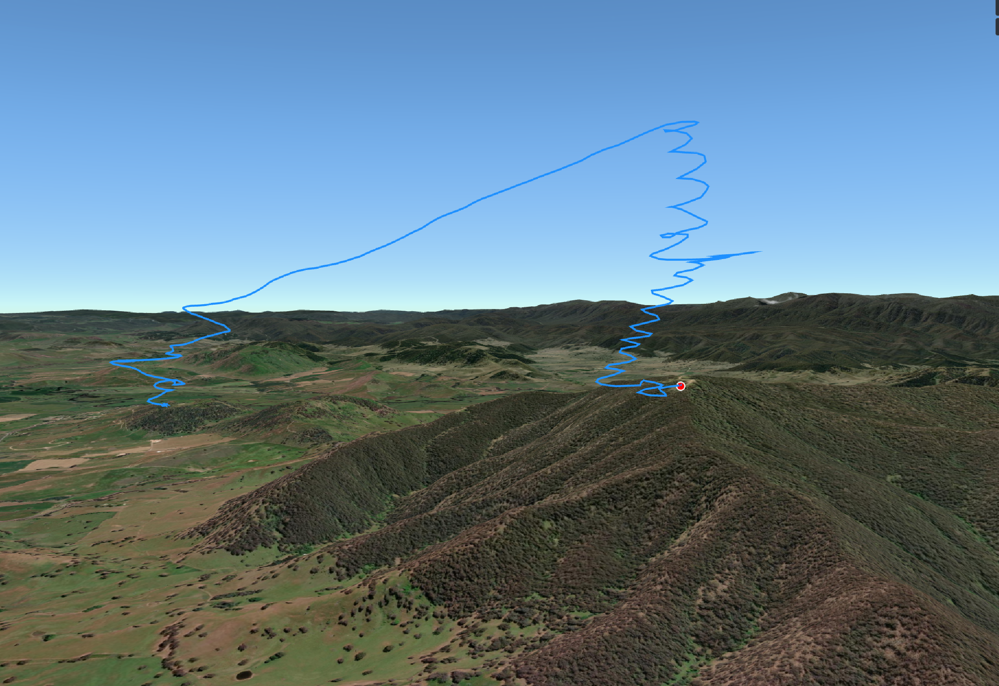

# IGC Studio

<p align="center">
  
</p>

<p align="center">
  A desktop paragliding flight log viewer built by a pilot, for pilots.
</p>

<p align="center">
  <a href="https://github.com/RPBatchelor/igc-studio/releases/latest"></a>
  
  
</p>

---

## What is IGC Studio?

IGC Studio is a free, open-source desktop application for paraglider and hang glider pilots to browse, replay, and analyse their flight logs. It runs entirely offline on your own machine — no accounts, no subscriptions, no cloud uploads.

Load an `.igc` or `.kml` file and immediately see your flight rendered as a 3D track on a satellite map, with charts for altitude, speed, and distance, a scrubable timeline, and full flight statistics. Open a folder of years' worth of flights and IGC Studio groups them into launch sites automatically, letting you explore your history by location rather than digging through folders.

---

## Screenshots

<table>
  <tr>
    <td align="center"><b>VS Code-style folder browser</b></td>
    <td align="center"><b>Location grouping</b></td>
  </tr>
  <tr>
    <td></td>
    <td></td>
  </tr>
</table>

### 3D Terrain Flight View



---

## Features

### Flight Browsing
- **File explorer** — VS Code-style tree view; browse `.igc` and `.kml` files organised by year and folder
- **Locations panel** — automatically clusters all flights in your library into launch sites using GPS coordinates; groups flights within 3 km of each other; site names resolved via OpenStreetMap reverse geocoding
- **Site renaming** — double-click any site name to give it a custom label that persists across sessions
- **Global search** — `Ctrl+K` palette searches your flight sites by name and lists individual flights; also geocodes any place name via OpenStreetMap so you can fly the camera to any location in Australia
- **File type filter** — toggle IGC and KML visibility independently across both the Explorer and Locations panels

### Map & Visualisation
- **3D globe** — interactive CesiumJS globe centred over Australia; satellite, topo, street, and canvas base layers
- **Flight track** — 3D polyline rendered at GPS altitude along the terrain
- **Animated pilot marker** — red dot interpolates along the track in sync with the timeline
- **3D terrain** — optional Cesium World Terrain elevation model (requires a free Cesium Ion token)
- **Multiple base layers** — ESRI Satellite, ESRI Topo, National Geographic, OpenTopoMap, OpenStreetMap, Bing Aerial, Bing Roads, ESRI Light/Dark Grey, Carto Light/Dark
- **Road overlay** — ESRI road layer toggleable on top of any base
- **Camera position overlay** — toggleable lat/lng/altitude readout at the bottom-right of the map
- **Map controls** — zoom in/out, reset north, fly-to-flight buttons

### Airspace
- **Australian airspace** — downloads the current OpenAir dataset from [xcaustralia.org](https://xcaustralia.org/download/); displayed as colour-coded 3D extruded polygons (CTR = red, Class D = blue, Restricted = orange, etc.)
- **30-day cache** — loads instantly on restart; background version check alerts you when new data is available
- **Manual import** — load any `.txt` OpenAir file from disk as a fallback
- **Configurable URL** — change the airspace source in Settings if you prefer a different feed

### Site Guide Zones
- **Landing & no-landing zones** — downloads zone polygons from [siteguide.org.au](https://siteguide.org.au/Downloads); rendered as ground-clamped coloured overlays on the 3D map
- **Colour coding** — blue = landing zone, red = no landing, amber = emergency landing, orange = no launch, yellow = powerline, orange-red = hazard
- **Hover tooltip** — mouse over any zone to see its type and name
- **Map legend** — automatically shows the zone types present in the loaded data
- **7-day cache** — zones load instantly after the first download

### Flight Statistics & Charts
- **Stats panel** — duration, max/min altitude, total altitude gain, max/average speed, total distance
- **Live charts** — altitude, speed, and distance profiles plotted against time; playback cursor syncs with the timeline
- **Unit switching** — metric (m, km, km/h) or imperial (ft, mi, kts) throughout

### Timeline & Playback
- **Scrubber** — drag to any point in the flight
- **Play/pause** — animated playback at variable speed
- **Speed control** — 1× through 50×
- **Jump controls** — skip to start or end instantly

### Settings & Customisation
- **Dark / light theme**
- **Default zoom altitude** — controls how close the camera flies when a flight is opened
- **Reopen last folder on startup** — restores your previous session automatically
- **Show camera position overlay** — toggles the lat/lng/alt HUD
- **Cesium Ion token** — paste your free token to enable 3D terrain
- **Bing Maps key** — enables Bing Aerial and Bing Roads imagery layers
- **Airspace URL** — override the default airspace download source
- All settings persisted locally; API keys stored in a separate `.secrets` file that is never committed to git

---

## Supported File Formats

| Format | Extension | Notes |
|--------|-----------|-------|
| IGC    | `.igc`    | Standard FAI flight recorder format; reads B-records (GPS fixes) and H-records (metadata) |
| KML    | `.kml`    | Google Earth format; reads `<gx:coord>` and `<coordinates>` track elements |

---

## Installation

### Download (Windows)

Grab the latest installer from the [Releases page](https://github.com/RPBatchelor/igc-studio/releases/latest):

- **`IGC Studio_x.x.x_x64-setup.exe`** — NSIS installer *(recommended)*
- **`IGC Studio_x.x.x_x64_en-US.msi`** — MSI installer

Run the installer, launch **IGC Studio** from the Start menu, and open a folder containing your flight logs.

> **Note:** Windows may show a SmartScreen warning on first run because the app is not yet code-signed. Click **More info → Run anyway** to proceed.

### Build from Source

#### Prerequisites

- [Node.js](https://nodejs.org) 18+
- [Rust](https://rustup.rs) toolchain

```bash
# Install Rust via rustup (Windows)
winget install Rustlang.Rustup
```

#### Run in development

```bash
git clone https://github.com/RPBatchelor/igc-studio.git
cd igc-studio

npm install

# Desktop app (requires Rust)
npx tauri dev
```

#### Build a release installer

```bash
npx tauri build
# Outputs to src-tauri/target/release/bundle/
```

---

## Usage

### Loading flights

1. Click the **folder icon** (Explorer) in the activity bar on the left
2. Click **Open Folder** and select the root directory containing your flight logs
3. Click any `.igc` or `.kml` file in the tree to load it
4. The 3D map, stats panel, and charts populate immediately

### Using the Locations panel

1. Click the **pin icon** (Locations) in the activity bar
2. IGC Studio scans your entire folder tree and groups flights into launch sites
3. Click a site to expand it and see all flights there
4. Click any flight to load it

### Searching

- Press `Ctrl+K` or click the search bar at the top of the window
- Type a site name to see individual flights — click one to load it and fly the camera there
- Type any place name (e.g. *Bright*, *Mount Baw Baw*) to fly the camera to that location

### Airspace & zones

1. Click the **layers icon** (Map Layers) in the activity bar
2. Under **Airspace**, tick **Show Airspace** — data downloads automatically on first use
3. Under **Site Guide Zones**, tick **Landing & No-Landing Zones** — zones download automatically
4. Hover over any zone on the map for its name and type

### 3D Terrain

1. Get a free token at [cesium.com/ion/signup](https://cesium.com/ion/signup)
2. Click the **gear icon** (Settings) → paste your token under **Cesium Ion Token**
3. Click the **layers icon** → enable **3D Terrain**

---

## Project Structure

```
igc-studio/
├── src/                          # React / TypeScript frontend
│   ├── components/
│   │   ├── explorer/             # FileExplorer, LocationsPanel, MapLayers
│   │   ├── layout/               # PanelLayout, custom title bar
│   │   ├── map/                  # FlightMap (CesiumJS)
│   │   ├── search/               # GlobalSearch palette
│   │   ├── stats/                # FlightStats, FlightCharts
│   │   └── timeline/             # TimelineScrubber
│   ├── hooks/                    # useFileSystem, useFlightAnimation
│   ├── lib/                      # airspaceApi, airspaceParser, sgZonesApi,
│   │                             #   settingsDb, siteDb, siteScanner, stats
│   ├── parsers/                  # IGC & KML parsers, shared TypeScript types
│   └── stores/                   # Zustand global store (flightStore)
└── src-tauri/                    # Tauri v2 Rust backend
    ├── src/
    │   └── commands/fs.rs        # read_directory, read_file_text,
    │                             #   write_file_text, scan_flights,
    │                             #   fetch_url_text, get_data_dir
    └── capabilities/             # Tauri permission declarations
```

---

## Roadmap

- [ ] Colour-coded flight track (altitude / speed / vario gradient)
- [ ] XC scoring and triangle detection
- [ ] Flight comparison — overlay multiple tracks simultaneously
- [ ] Thermal map overlay (kk7.ch)
- [ ] Export to GPX / KMZ
- [ ] Weather data integration
- [ ] macOS and Linux builds
- [ ] Code signing for Windows (no SmartScreen warning)

---

## Contributing

Contributions are welcome. This project follows a straightforward GitHub flow:

### Getting started

```bash
git clone https://github.com/RPBatchelor/igc-studio.git
cd igc-studio
npm install
npx tauri dev
```

### Branches

| Branch | Purpose |
|--------|---------|
| `master` | Stable release branch — only release merges land here |
| `dev` | Active development — all feature branches merge into `dev` |

Create feature branches off `dev`:

```bash
git checkout dev
git checkout -b feat/my-feature
```

### Submitting changes

1. Make your changes on a feature branch
2. Ensure TypeScript compiles cleanly: `npx tsc --noEmit`
3. Test with `npx tauri dev`
4. Open a pull request targeting the `dev` branch
5. Describe what changed and why in the PR description

### Code style

- TypeScript strict mode — no `any` unless absolutely necessary
- React functional components with hooks only — no class components
- Zustand store actions are plain setters; async logic lives in `src/lib/` or hooks
- New Tauri backend commands go in `src-tauri/src/commands/fs.rs` and must be registered in `src-tauri/src/lib.rs` and `capabilities/default.json`

### Reporting issues

Open an issue on [GitHub Issues](https://github.com/RPBatchelor/igc-studio/issues) with:
- Your OS and version
- Steps to reproduce
- The flight file if relevant (IGC files contain no personal data beyond pilot name)

---

## Tech Stack

| Layer | Technology |
|-------|-----------|
| Desktop shell | [Tauri v2](https://tauri.app) + Rust |
| UI framework | [React 19](https://react.dev) + TypeScript |
| Build tool | [Vite 8](https://vitejs.dev) |
| 3D map | [CesiumJS 1.139](https://cesium.com) |
| Charts | [Recharts](https://recharts.org) |
| State | [Zustand](https://zustand-demo.pmnd.rs) |
| Styling | [Tailwind CSS v4](https://tailwindcss.com) |
| Icons | [Lucide React](https://lucide.dev) |
| HTTP (Rust) | [reqwest](https://docs.rs/reqwest) |

---

## Data Sources

| Source | Usage | License |
|--------|-------|---------|
| [xcaustralia.org](https://xcaustralia.org/download/) | Australian airspace (OpenAir) | Free for personal use |
| [siteguide.org.au](https://siteguide.org.au/Downloads) | Landing/no-landing zone polygons | Free for personal use |
| [OpenStreetMap Nominatim](https://nominatim.openstreetmap.org) | Forward and reverse geocoding | © OpenStreetMap contributors, [ODbL](https://www.openstreetmap.org/copyright) |
| [ESRI](https://www.esri.com) | Satellite, topo, and road tile layers | Free for non-commercial use |
| [Cesium Ion](https://cesium.com/ion/) | World Terrain elevation model | Free tier available |

---

## License

MIT License — see [LICENSE](LICENSE) for full text.

Copyright © 2025 Ryan Batchelor

Permission is hereby granted, free of charge, to any person obtaining a copy of this software to use, copy, modify, merge, publish, distribute, sublicense, and/or sell copies of the software, subject to the following conditions:

- The above copyright notice and this permission notice shall be included in all copies or substantial portions of the software.
- THE SOFTWARE IS PROVIDED "AS IS", WITHOUT WARRANTY OF ANY KIND.

Third-party data sources (airspace, site guide zones, map tiles) have their own terms of use as noted above. This application is intended for **personal, recreational use only**. It must not be used as a primary navigation tool or as a substitute for official airspace information.
