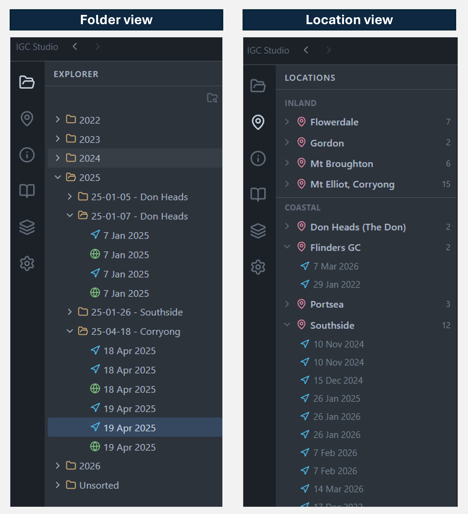
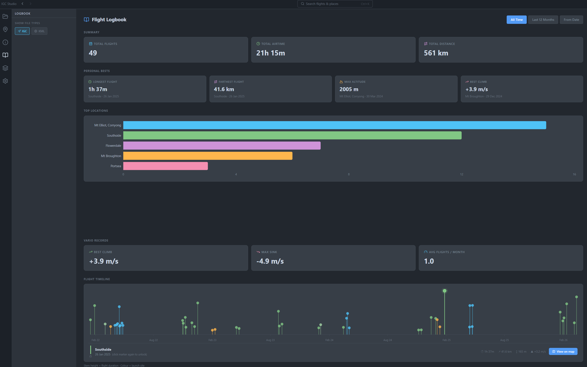
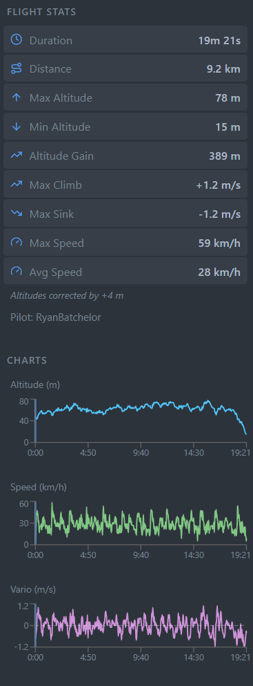

# IGC Studio

<p align="center">
  
</p>

<p align="center">
  A desktop paragliding flight log viewer built by a pilot, for pilots.
</p>

<p align="center">
  <a href="https://github.com/RPBatchelor/igc-studio/releases/latest"></a>
  
  
</p>

---

IGC Studio is a free, open-source desktop app for paraglider and hang glider pilots to browse, replay, and analyse flight logs. It runs entirely offline — no accounts, no cloud uploads, no subscriptions.

Load an `.igc` or `.kml` file and immediately see your flight on a 3D terrain map with altitude-gradient colouring, full statistics, interactive charts, and an animated timeline scrubber. Open a folder of years of flights and IGC Studio clusters them into launch sites automatically, so you can explore your history by location rather than digging through folders.

---

## Screenshots

### File Browser & Location Grouping



Browse your flights as a VS Code-style folder tree (left) or grouped automatically by launch site (right). Site names are resolved via OpenStreetMap reverse geocoding and can be renamed with a double-click.

---

### 3D Map — Altitude-Gradient Track & Site Guide Zones


The full app layout: activity bar, resizable side panels, CesiumJS 3D globe, and the right-hand stats/charts panel. The flight track is colour-coded by altitude. Landing zones and no-landing zones from siteguide.org.au are rendered as ground-clamped overlays, with a legend and hover tooltips.

---

### Logbook



The Logbook tab aggregates every flight in your library into a timeline chart. Lollipop markers are sized by flight duration and coloured by launch site. Click a marker to lock it and see stats in the right panel; click **View on map** to jump straight to that flight.

---

### Flight Statistics



At-a-glance stats for the loaded flight: duration, distance, max altitude, max climb and sink rates. Charts show altitude, speed, and vario profiles against time with a live playback cursor.

---

### Altitude Correction & Flight Trim


**Altitude Correction** lets you offset the GPS altitude to match terrain at launch — dial it manually or click *Auto from terrain* (requires a Cesium Ion token). **Flight Trim** lets you cut away pre-takeoff and post-landing data using a dual-handle range slider overlaid on the altitude profile; a `.bak` of the original is always kept.

---

## Features

### Flight Browsing
- **File explorer** — VS Code-style tree; browse `.igc` and `.kml` files across folders and years
- **Locations panel** — clusters all flights in your library into launch sites (within 3 km); names resolved via OpenStreetMap reverse geocoding
- **Site renaming** — double-click any site name to give it a custom label that persists across sessions
- **Global search** — `Ctrl+K` palette searches flight sites and individual flights; geocodes any place name so you can fly the camera anywhere
- **File type filter** — toggle IGC and KML visibility independently
- **Back / Forward** navigation — browser-style history for quick switching between flights and views

### Map & Visualisation
- **3D globe** — interactive CesiumJS globe; satellite, topo, street, and canvas base layers
- **Altitude-gradient flight track** — polyline colour-coded from low (blue) to high (red) rendered at GPS altitude
- **Animated pilot marker** — dot interpolates along the track in sync with the timeline
- **Shadow curtain** — semi-transparent vertical wall trails behind the glider during playback, showing the ground track and altitude profile simultaneously
- **3D terrain** — Cesium World Terrain elevation model (requires a free Cesium Ion token)
- **Multiple base layers** — ESRI Satellite, ESRI Topo, National Geographic, OpenTopoMap, OpenStreetMap, Bing Aerial, Bing Roads, ESRI Light/Dark Grey, Carto Light/Dark
- **Road overlay** — ESRI road layer on top of any base
- **Map controls** — zoom, reset north, fly-to-flight

### Airspace
- **Australian airspace** — downloads the current OpenAir dataset from [xcaustralia.org](https://xcaustralia.org/download/); 3D extruded polygons colour-coded by class (CTR = red, Class D = blue, Restricted = orange, etc.)
- **30-day cache** — loads instantly on restart; background check alerts when new data is available
- **Manual import** — load any `.txt` OpenAir file as a fallback
- **Configurable source URL** — change the download endpoint in Settings

### Site Guide Zones
- **Landing & no-landing zones** — zone polygons from [siteguide.org.au](https://siteguide.org.au/Downloads); ground-clamped overlays on the 3D map
- **Colour coding** — blue = landing, red = no landing, amber = emergency, orange = no launch, yellow = powerline, orange-red = hazard
- **Hover tooltip** — zone type and name on mouse-over
- **Map legend** — shows the zone types present in the loaded data
- **7-day cache**

### Flight Statistics & Charts
- **Stats panel** — duration, max/min altitude, altitude gain, max/average speed, total distance
- **Live charts** — altitude, speed, and vario profiles against time; playback cursor stays in sync
- **Unit switching** — metric (m, km, km/h) or imperial (ft, mi, kts)

### Logbook
- **Timeline view** — all flights plotted as lollipops sized by duration and coloured by launch site
- **Hover / click** to lock a flight and see stats in the right panel
- **View on map** — one click loads the full flight and flies the camera there
- **Date filtering** — show all flights, last 12 months, or a custom date range

### Altitude Correction
- **Per-flight offset** — dial in a metres adjustment to reconcile GPS altitude against terrain
- **Auto from terrain** — one-click calculation using the Cesium terrain height at launch
- **Persisted** — offset saved per-flight in `flight-notes.json`; restored automatically on reload

### Flight Trim
- **Dual-handle range slider** — visually trim pre-takeoff and post-landing clutter
- **Non-destructive** — original file always backed up as `.igc.bak` before any write
- **Restore** — one-click revert to the original at any time; backup never deleted by the app

### Timeline & Playback
- **Scrubber** — drag to any point in the flight
- **Play / pause** with variable speed (1× – 50×)
- **Jump to start / end**

### Settings & Customisation
- Dark / light theme
- Default zoom altitude
- Reopen last folder on startup
- Cesium Ion token (enables 3D terrain)
- Bing Maps key (enables Bing imagery layers)
- Airspace source URL
- All settings persisted locally; API keys stored in a separate `.secrets` file excluded from git

---

## Supported File Formats

| Format | Extension | Notes |
|--------|-----------|-------|
| IGC    | `.igc`    | FAI flight recorder format; reads B-records (GPS fixes) and H-records (metadata) |
| KML    | `.kml`    | Google Earth format; reads `<gx:coord>` and `<coordinates>` track elements |

---

## Installation

### Download (Windows)

Grab the latest installer from the [Releases page](https://github.com/RPBatchelor/igc-studio/releases/latest):

- **`IGC Studio_x.x.x_x64-setup.exe`** — NSIS installer *(recommended)*
- **`IGC Studio_x.x.x_x64_en-US.msi`** — MSI installer

Run the installer, launch **IGC Studio** from the Start menu, and open a folder containing your flight logs.

> **Note:** Windows may show a SmartScreen warning on first run because the app is not yet code-signed. Click **More info → Run anyway** to proceed.

---

## Development

### Prerequisites

- [Node.js](https://nodejs.org) 18+
- [Rust](https://rustup.rs) toolchain

```bash
# Install Rust via rustup (Windows)
winget install Rustlang.Rustup
```

### Run in development

```bash
git clone https://github.com/RPBatchelor/igc-studio.git
cd igc-studio
npm install
npx tauri dev
```

### Build a release installer

```bash
npx tauri build
# Outputs to src-tauri/target/release/bundle/
```

### Project structure

```
igc-studio/
├── src/                          # React / TypeScript frontend
│   ├── components/
│   │   ├── explorer/             # FileExplorer, LocationsPanel, MapLayers
│   │   ├── layout/               # PanelLayout, custom title bar
│   │   ├── logbook/              # LogbookView, LogbookPanel, LogbookTimeline
│   │   ├── map/                  # FlightMap (CesiumJS) + hooks
│   │   ├── search/               # GlobalSearch palette
│   │   ├── sites/                # SiteInfoPanel, SiteInfoEditor, SiteFiltersPanel
│   │   ├── stats/                # FlightStats, FlightCharts, FlightNotes,
│   │   │                         #   FlightAltitudeCorrection, FlightTrim
│   │   └── timeline/             # TimelineScrubber
│   ├── hooks/                    # useFileSystem, useFlightAnimation
│   ├── lib/                      # airspaceApi, airspaceParser, sgZonesApi,
│   │                             #   flightLoader, flightTrimmer, settingsDb,
│   │                             #   siteDb, siteScanner, stats, tilePrefetch
│   ├── parsers/                  # IGC & KML parsers, shared TypeScript types
│   └── stores/                   # Zustand global store (flightStore)
└── src-tauri/                    # Tauri v2 Rust backend
    ├── src/
    │   └── commands/fs.rs        # read_directory, read_file_text,
    │                             #   write_file_text, scan_flights,
    │                             #   fetch_url_text, get_data_dir
    └── capabilities/             # Tauri permission declarations
```

### Code style

- TypeScript strict mode — no `any` unless unavoidable
- React functional components with hooks only
- Zustand store actions are plain setters; async logic lives in `src/lib/` or hooks
- New Tauri commands go in `src-tauri/src/commands/fs.rs` and must be registered in `src-tauri/src/lib.rs` and `capabilities/default.json`
- Type-check before opening a PR: `npx tsc --noEmit`

### Branches

| Branch | Purpose |
|--------|---------|
| `master` | Stable release — only release merges land here |
| `dev` | Active development — all feature branches merge into `dev` |

---

## Roadmap

- [ ] XC scoring and triangle detection
- [ ] Flight comparison — overlay multiple tracks simultaneously
- [ ] Thermal map overlay (kk7.ch)
- [ ] Export to GPX / KMZ
- [ ] macOS and Linux builds
- [ ] Code signing for Windows (no SmartScreen warning)

---

## Tech Stack

| Layer | Technology |
|-------|-----------|
| Desktop shell | [Tauri v2](https://tauri.app) + Rust |
| UI framework | [React 19](https://react.dev) + TypeScript |
| Build tool | [Vite](https://vitejs.dev) |
| 3D map | [CesiumJS 1.139](https://cesium.com) |
| Charts | [Recharts](https://recharts.org) |
| State | [Zustand](https://zustand-demo.pmnd.rs) |
| Icons | [Lucide React](https://lucide.dev) |
| HTTP (Rust) | [reqwest](https://docs.rs/reqwest) |

---

## Data Sources

| Source | Usage | License |
|--------|-------|---------|
| [xcaustralia.org](https://xcaustralia.org/download/) | Australian airspace (OpenAir) | Free for personal use |
| [siteguide.org.au](https://siteguide.org.au/Downloads) | Landing/no-landing zone polygons | Free for personal use |
| [OpenStreetMap Nominatim](https://nominatim.openstreetmap.org) | Forward and reverse geocoding | © OpenStreetMap contributors, [ODbL](https://www.openstreetmap.org/copyright) |
| [ESRI](https://www.esri.com) | Satellite, topo, and road tile layers | Free for non-commercial use |
| [Cesium Ion](https://cesium.com/ion/) | World Terrain elevation model | Free tier available |

---

## License

MIT License — see [LICENSE](LICENSE) for full text.

Copyright © 2025 Ryan Batchelor

This application is intended for **personal, recreational use only**. It must not be used as a primary navigation tool or as a substitute for official airspace information.
